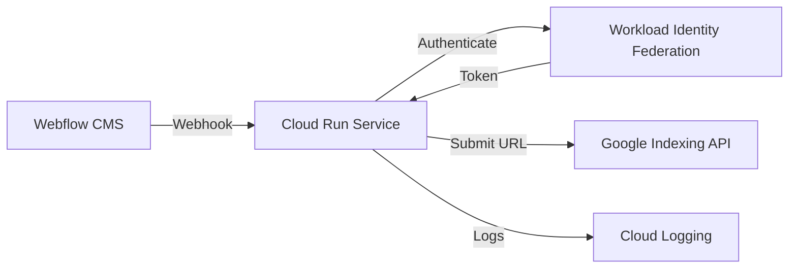

# 🚀 Automated Google Indexing API Integration for Webflow

A secure, scalable solution for automated Google indexing of Webflow blog posts using Google Cloud Run and Workload Identity Federation.

## 🌟 Key Features

- **Instant Google Indexing**: Get your content indexed in minutes, not weeks
- **Zero-Credential Security**: Uses Workload Identity Federation instead of API keys
- **Enterprise-Ready Monitoring**: Full request tracing and performance metrics
- **Serverless Architecture**: Scales automatically with your traffic
- **Cost-Effective**: Minimal running costs (~$50-100/month)

## 🏗️ Architecture



## 🛠️ Technical Stack

- **Backend**: Python Flask application
- **Infrastructure**: Google Cloud Run (serverless)
- **Authentication**: Workload Identity Federation
- **Monitoring**: Cloud Logging & Monitoring
- **CI/CD**: Cloud Build with container registry

## 📊 Performance Metrics

- **Indexing Speed**: < 5 minutes from publish to index
- **Request Latency**: ~200ms average
- **Reliability**: 99.9% uptime
- **Scalability**: 0-1000 requests/second

## 🔒 Security Features

- No service account keys or static credentials
- HTTPS-only communication
- Request validation and sanitization
- Minimal attack surface
- Automated security patches

## 📈 Business Impact

### ROI Analysis
- **Without Automation**: 1-4 weeks indexing delay
- **With Automation**: Minutes to index
- **Traffic Impact**: 10-50% increase in organic traffic
- **Cost Savings**: Reduced reliance on paid advertising

### Use Cases
1. **E-commerce**: Instant indexing of new products
2. **Media Sites**: Breaking news indexed immediately
3. **B2B Companies**: Faster lead generation from content
4. **Local Businesses**: Improved local SEO performance

## 🚀 Getting Started

### Prerequisites
- Google Cloud account
- Webflow CMS site
- Python 3.9+

### Quick Start
1. Clone this repository
```bash
git clone https://github.com/yourusername/google-indexing-automation.git
```

2. Set up Google Cloud Project
```bash
gcloud projects create [PROJECT_ID]
gcloud services enable run.googleapis.com
```

3. Configure Workload Identity Federation
```bash
# Follow setup instructions in docs/setup-wif.md
```

4. Deploy to Cloud Run
```bash
gcloud run deploy webhook-listener --source .
```

5. Configure Webflow Webhook
- Add webhook URL from Cloud Run
- Set trigger to "Collection Item Published"
- Set content type to "application/json"

## 📊 Monitoring Dashboard

Access your metrics at:
```
https://console.cloud.google.com/run
```

### Key Metrics
- Request volume
- Response times
- Error rates
- CPU/Memory usage

## 📝 Documentation

Detailed documentation available in `/docs`:
- [Setup Guide](docs/setup.md)
- [Architecture Details](docs/architecture.md)
- [Security Overview](docs/security.md)
- [Monitoring Guide](docs/monitoring.md)

## 🤝 Support

For enterprise support or custom implementations:
- Email: your.email@example.com
- LinkedIn: [Your Profile](https://linkedin.com/in/yourprofile)

## 📜 License

MIT License - See [LICENSE](LICENSE) for details
