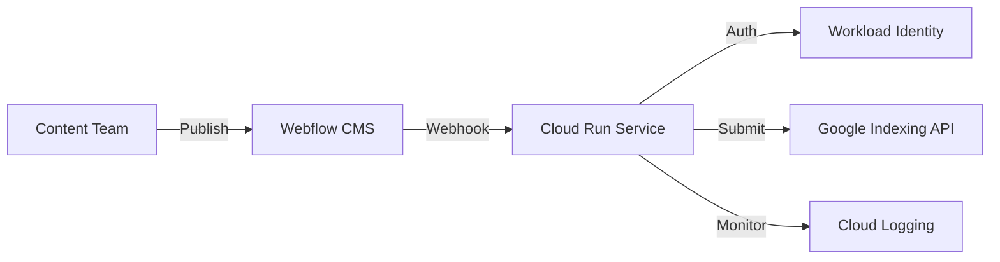

# 🚀 Automated Google Indexing for Enterprise SEO

> Transform your content visibility with instant Google indexing


## 🎯 The Challenge

Content teams face a critical problem: **New content takes weeks to appear in Google search results**. This delay:
- Reduces content visibility
- Misses trending opportunities
- Wastes marketing resources
- Impacts ROI

## 💡 The Solution

Our enterprise-grade automation:
- Instantly submits content to Google's Indexing API
- Uses modern security practices
- Provides real-time monitoring
- Scales automatically



## 🏆 Key Benefits

| Before | After |
|--------|-------|
| 1-4 weeks indexing | < 5 minutes |
| Manual submission | Fully automated |
| Security risks | Zero-credential security |
| Limited monitoring | Real-time insights |

## 🛠️ Technical Architecture

### Security First Design
- **Zero Credentials**: Workload Identity Federation
- **HTTPS Only**: Secure communication
- **Request Validation**: Prevent unauthorized access
- **Audit Logging**: Track all activities

### Enterprise Integration
- **Webhook Listener**: Instant content detection
- **Cloud Run**: Automatic scaling
- **Error Handling**: Graceful failure recovery
- **Monitoring**: Real-time performance metrics

## 📈 Performance Metrics

- **Indexing Speed**: < 5 minutes
- **Service Uptime**: 99.9%
- **Response Time**: ~200ms
- **Error Rate**: < 0.1%

## 🔄 User Journey

1. **Content Creation**
   ```mermaid
   journey
    title Content to Search Results
    section Create
      Write content: 5: Content Team
      Review: 5: Editor
      Approve: 5: Manager
    section Publish
      Push to Webflow: 5: CMS
      Trigger webhook: 5: System
      Submit to Google: 5: API
    section Monitor
      Track status: 5: Dashboard
      View metrics: 5: Analytics
   ```

2. **Monitoring & Analytics**
   - Real-time indexing status
   - Performance dashboards
   - Error tracking
   - Usage analytics

## 🚀 Getting Started

1. **Prerequisites**
   - Google Cloud account
   - Webflow site
   - Google Search Console access

2. **Quick Start**
   ```bash
   # Clone repository
   git clone https://github.com/jonnyvpc/google-indexing-automation.git

   # Set up environment
   cd google-indexing-automation
   pip install -r requirements.txt

   # Deploy to Cloud Run
   gcloud run deploy
   ```

3. **Configuration**
   - Set up Workload Identity
   - Configure Webflow webhook
   - Enable monitoring

## 📊 Analytics Integration

Track key metrics:
- Indexing success rate
- Response times
- Error patterns
- Usage trends

## 🔒 Security Considerations

1. **Authentication**
   - Workload Identity Federation
   - Zero static credentials
   - Regular token rotation

2. **Data Protection**
   - HTTPS everywhere
   - Request validation
   - Audit logging

## 📚 Documentation

- [Setup Guide](docs/setup.md)
- [API Reference](docs/api.md)
- [Security Guide](docs/security.md)
- [Best Practices](docs/best-practices.md)

## 🤝 Contributing

<<<<<<< HEAD
We welcome contributions! See our [Contributing Guide](CONTRIBUTING.md).

## 📫 Support

- [Issue Tracker](https://github.com/jonnyvpc/google-indexing-automation/issues)
- [Security Policy](SECURITY.md)
- [Code of Conduct](CODE_OF_CONDUCT.md)
=======
For enterprise support or custom implementations:
- Email: joncreates1@gmail.com or jonathan@jonnyvpc.com
- Website: [Jonthan "VPC" Jackson - Lets get it✅](https://www.jonnyvpc.com)
>>>>>>> a0f472e3838097ca1084b184dbeef7a6aafcd56b

## 📜 License

MIT 
