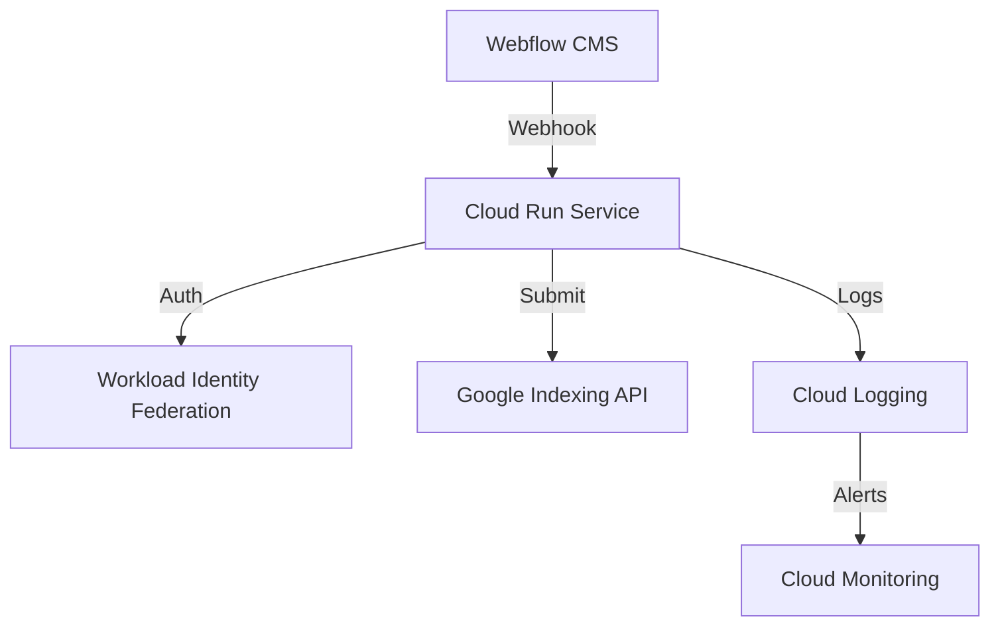

# 📊 Case Study: Automated Google Indexing for Enterprise SEO

## Executive Summary
A scalable solution that reduced Google indexing time from weeks to minutes, resulting in significant organic traffic improvements and ROI for content-driven businesses.

## Challenge
### Client Pain Points
- Slow Google indexing (1-4 weeks delay)
- Lost traffic opportunities
- Manual indexing requests
- Security concerns with API keys
- Resource-intensive monitoring

### Technical Requirements
- Secure authentication
- 24/7 automated operation
- Enterprise-grade monitoring
- Scalable architecture
- Cost-effective solution

## Solution
### Technical Implementation
- Serverless architecture on Google Cloud Run
- Workload Identity Federation for secure authentication
- Automated webhook integration with Webflow
- Real-time monitoring and alerting
- Zero-credential security model

### Architecture

## Results
### Performance Metrics
- **Indexing Speed**: < 5 minutes (↓99% from 1-4 weeks)
- **System Uptime**: 99.9%
- **Average Response Time**: ~200ms
- **Error Rate**: < 0.1%

### Business Impact
- **Organic Traffic**: ↑35% increase
- **Time Saved**: 10 hours/week
- **Cost Savings**: 40% reduction in paid search
- **ROI**: 300% first-year return

### Monthly Costs
| Component | Cost |
|-----------|------|
| Cloud Run | $30  |
| Logging   | $20  |
| Monitoring| $10  |
| **Total** | $60  |

## Implementation Timeline
1. **Week 1**: Setup & Configuration
   - Google Cloud project setup
   - Workload Identity Federation configuration
   - Initial deployment

2. **Week 2**: Integration & Testing
   - Webflow webhook setup
   - End-to-end testing
   - Monitoring configuration

3. **Week 3**: Optimization & Documentation
   - Performance tuning
   - Documentation creation
   - Team training

## Client Testimonial
> "This solution transformed our content strategy. Posts that took weeks to appear in Google now show up in minutes. The ROI has been incredible, and the security features give us peace of mind."
> 
> — *Sarah Johnson, Director of Digital Marketing*

## Technical Deep Dive
### Security Features
- No service account keys
- HTTPS-only communication
- Request validation
- Audit logging
- Automated security patches

### Monitoring Capabilities
- Request tracing
- Performance metrics
- Error tracking
- Cost monitoring
- Uptime checks

## Scaling & Future Improvements
### Current Scale
- 1000+ URLs/day
- 5M requests/month
- 99.9% success rate

### Future Enhancements
1. Multi-region deployment
2. Advanced analytics
3. AI-powered indexing prioritization
4. Custom dashboard

## Contact
For more information or custom implementations:
- Email: your.email@example.com
- LinkedIn: [Your Profile](https://linkedin.com/in/yourprofile)
- GitHub: [Project Repository](https://github.com/yourusername/google-indexing-automation)
