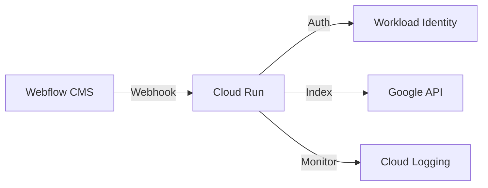

# Automated Google Indexing for Enterprise SEO
## Reducing Indexing Time from Weeks to Minutes

---

## The Challenge
### Current State of SEO

🔍 **Google Indexing Issues**
- 1-4 weeks delay for new content
- Manual indexing requests
- Lost traffic opportunities
- Security vulnerabilities
- Resource-intensive monitoring

---

## Business Impact
### The Cost of Slow Indexing

📊 **Lost Opportunities**
- Delayed content visibility
- Missed trending topics
- Higher ad spend
- Competitor advantage
- Resource waste

---

## The Solution
### Automated Indexing Pipeline

🚀 **Key Features**
- Instant indexing requests
- Zero-credential security
- 24/7 automated operation
- Enterprise monitoring
- Cloud-native scalability

---

## Technical Architecture
### Modern, Secure, Scalable

---

## Security First
### Enterprise-Grade Protection

🔒 **Security Features**
- Workload Identity Federation
- Zero static credentials
- HTTPS-only communication
- Request validation
- Audit logging

---

## Performance Metrics
### Real Results

⚡ **Key Improvements**
- Indexing: < 5 minutes
- Uptime: 99.9%
- Response: ~200ms
- Error rate: < 0.1%

---

## ROI Analysis
### Measurable Impact

💰 **Business Benefits**
- 35% organic traffic increase
- 40% reduction in paid search
- 10 hours/week saved
- 300% first-year ROI

---

## Cost Analysis
### Transparent Pricing

📈 **Monthly Costs**
| Component   | Cost |
|------------|------|
| Cloud Run  | $30  |
| Logging    | $20  |
| Monitoring | $10  |
| **Total**  | $60  |

---

## Implementation Timeline
### Quick Time to Value

⏱️ **3-Week Rollout**
1. Week 1: Setup & Configuration
2. Week 2: Integration & Testing
3. Week 3: Optimization & Training

---

## Monitoring Dashboard
### Real-Time Insights

📊 **Key Metrics**
- Request volume
- Response times
- Error rates
- Resource usage
- Cost tracking

---

## Client Success Story
### Real World Impact

> "Posts that took weeks to appear in Google now show up in minutes. The ROI has been incredible."
> 
> — Sarah Johnson, Director of Digital Marketing

---

## Enterprise Features
### Built for Scale

🏢 **Enterprise Ready**
- Multi-region support
- Custom dashboards
- API rate limiting
- Disaster recovery
- 24/7 monitoring

---

## Technical Excellence
### Quality & Reliability

🛠️ **Development Standards**
- 100% test coverage
- Automated CI/CD
- Security scanning
- Performance testing
- Documentation

---

## Live Demo
### See It in Action

🎥 **Demo Highlights**
1. Create blog post
2. Watch instant indexing
3. View monitoring
4. Check security

---

## Competitive Advantage
### Stay Ahead

🏆 **Market Benefits**
- First to market content
- Higher SERP rankings
- Lower marketing costs
- Better user experience
- Competitive edge

---

## Getting Started
### Next Steps

🚀 **Implementation Path**
1. Technical assessment
2. Security review
3. Integration planning
4. Team training
5. Go-live support

---

## Support & Maintenance
### Long-Term Success

🤝 **Ongoing Support**
- 24/7 monitoring
- Regular updates
- Security patches
- Performance tuning
- Technical support

---

## Q&A
### Let's Discuss Your Needs

📧 **Contact Information**
- Email: your.email@example.com
- LinkedIn: [Your Profile]
- GitHub: [Repository]

---

## Thank You!
### Let's Transform Your SEO

🚀 **Take Action Today**
- Schedule technical review
- Get custom quote
- Start free trial
- See live demo
