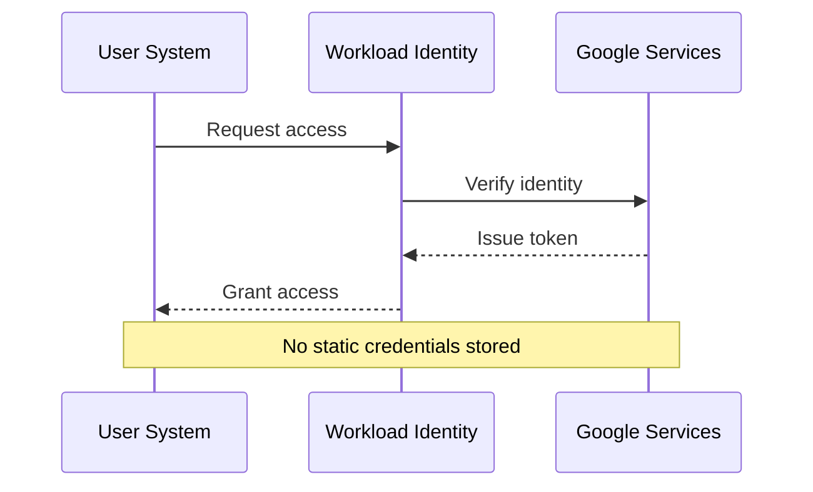
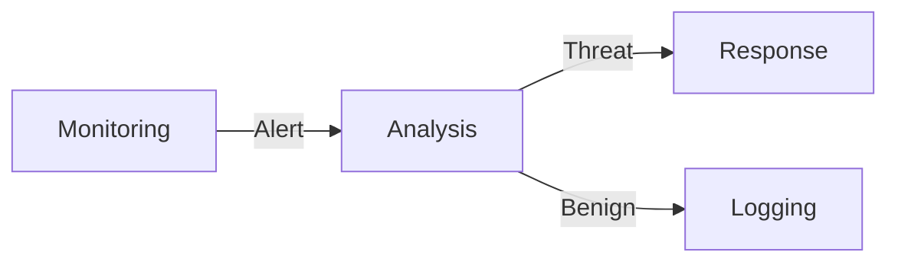
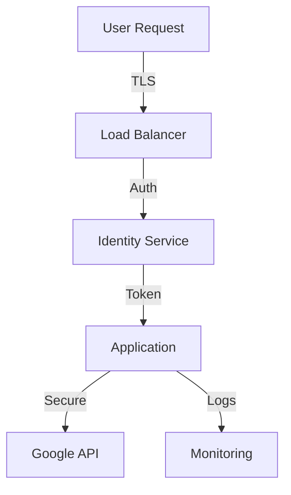

# Enterprise Security Architecture

## Security Philosophy

Our security architecture follows the principle of "Security by Design" while maintaining excellent user experience:

1. **Zero Trust Architecture**
   - No static credentials
   - Just-in-time access
   - Continuous verification

2. **Defense in Depth**
   - Multiple security layers
   - Redundant controls
   - Fail-secure defaults

3. **User-Centric Security**
   - Transparent protection
   - Clear security status
   - Non-intrusive measures

## Authentication Flow

## Security Controls

### 1. Access Control
- Workload Identity Federation
- Role-based access (RBAC)
- Principle of least privilege
- Regular access review

### 2. Data Protection
- TLS 1.3 encryption
- Data minimization
- Secure storage
- Regular backups

### 3. Monitoring & Auditing
- Real-time threat detection
- Comprehensive logging
- Audit trails
- Anomaly detection

## Security Measures

| Layer | Control | User Impact |
|-------|---------|-------------|
| Network | TLS 1.3 | Transparent |
| Authentication | WIF | Automatic |
| Authorization | RBAC | Role-based |
| Monitoring | Real-time | Dashboard |

## Incident Response

### Detection

### Response Plan
1. **Detect**
   - Automated monitoring
   - Alert triggers
   - User reports

2. **Analyze**
   - Threat assessment
   - Impact evaluation
   - Response planning

3. **Respond**
   - Immediate mitigation
   - User communication
   - System recovery

4. **Review**
   - Incident analysis
   - Process improvement
   - Documentation update

## Compliance

### Standards
- SOC 2 Type II
- ISO 27001
- GDPR
- CCPA

### Audit Support
- Comprehensive logs
- Access records
- Change tracking
- Security metrics

## Security Dashboard

### Real-Time Monitoring
- Access attempts
- Authentication status
- System health
- Threat indicators

### Security Metrics
- Authentication success rate
- Token refresh status
- Error patterns
- Response times

## Best Practices

### 1. Token Management
- Automatic rotation
- Secure storage
- Access monitoring
- Expiration handling

### 2. Error Handling
- Secure defaults
- Fail-safe operation
- Clear user feedback
- Automatic recovery

### 3. Logging
- Structured format
- Sensitive data handling
- Retention policies
- Access controls

## Security Architecture

## Implementation Guidelines

### Development
- Secure coding practices
- Dependency scanning
- Regular updates
- Security testing

### Deployment
- Infrastructure as Code
- Immutable infrastructure
- Container security
- Network isolation

### Monitoring
- Real-time alerts
- Performance metrics
- Security events
- User activity

## Disaster Recovery

### Backup Strategy
- Regular snapshots
- Encrypted backups
- Quick restoration
- Testing protocol

### Business Continuity
- Failover systems
- Data redundancy
- Service resilience
- Recovery procedures

## Future Enhancements

### Planned Features
1. **Advanced Security**
   - ML-based threat detection
   - Automated response
   - Enhanced monitoring

2. **Compliance**
   - Additional certifications
   - Enhanced reporting
   - Automated compliance

3. **User Security**
   - Enhanced visibility
   - Self-service tools
   - Security analytics
