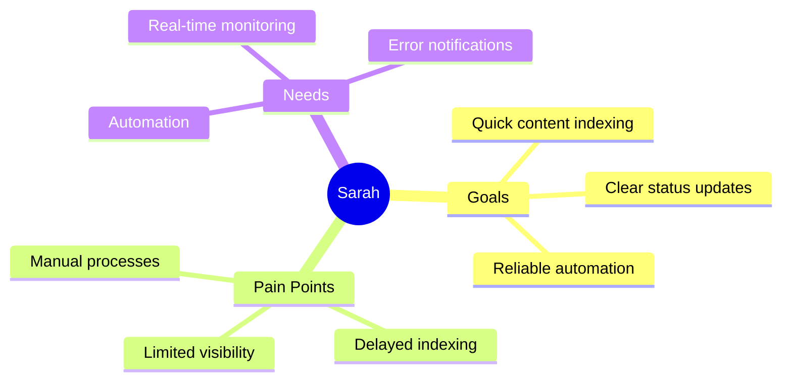
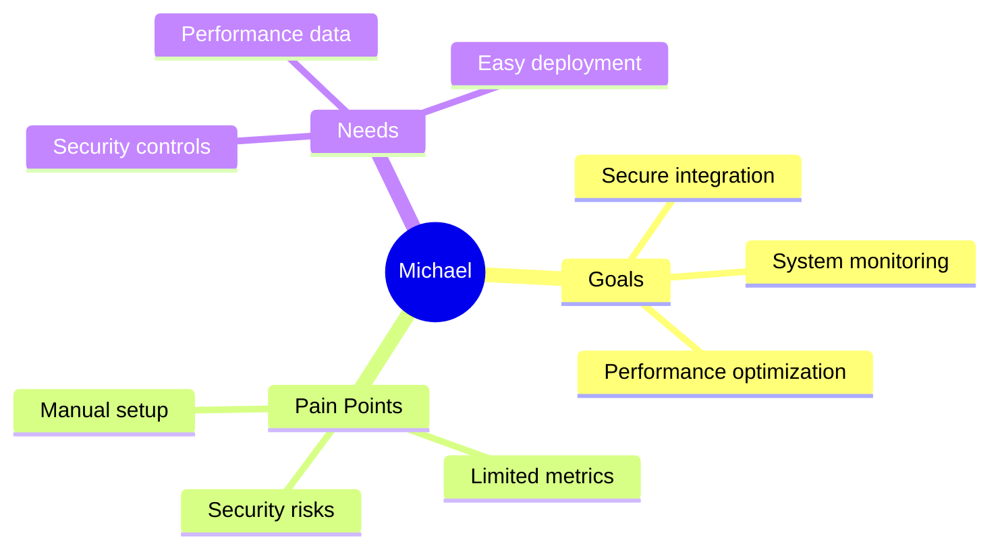
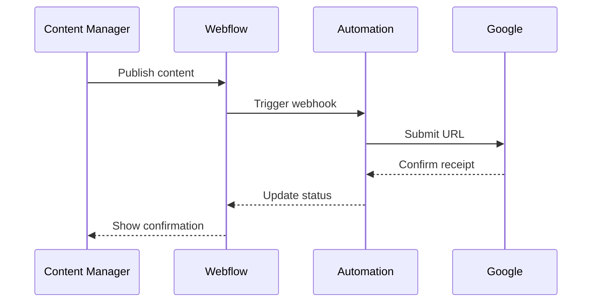
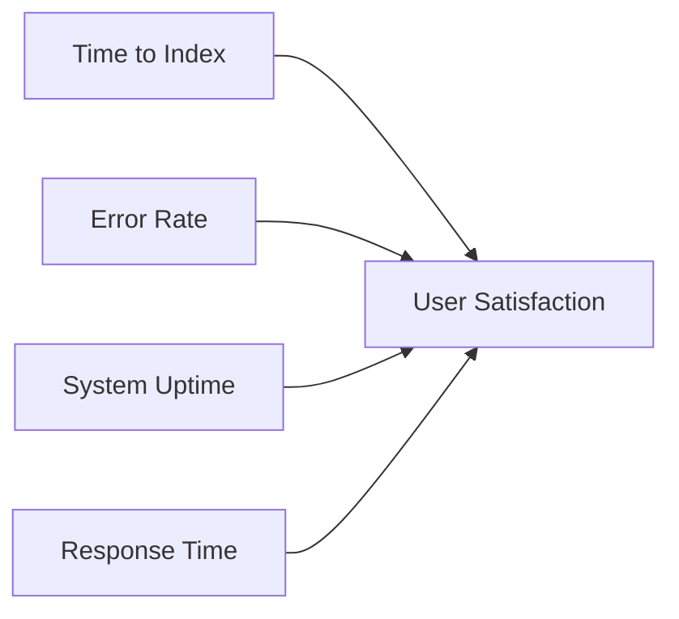
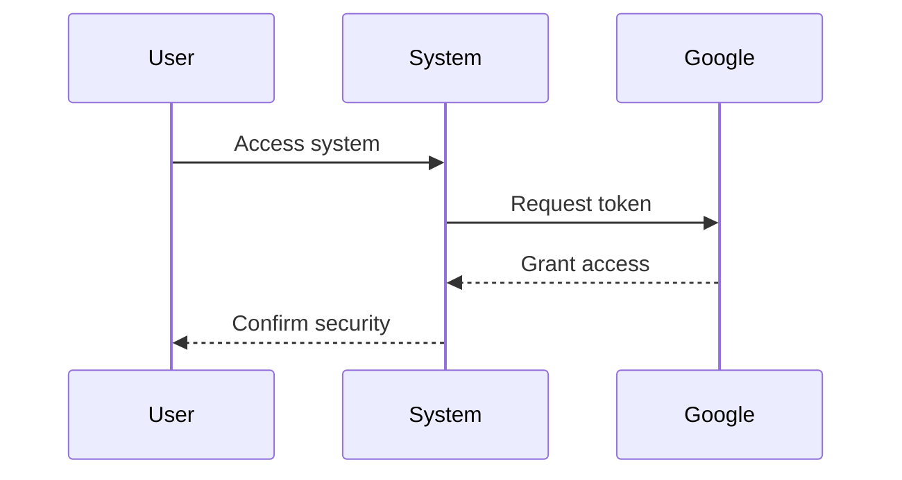
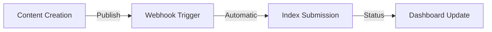

# UX Architecture & Design System

## Design Philosophy

Our solution is built on three core UX principles:

1. **Invisible Integration**
   - Zero-configuration setup
   - Automatic content detection
   - Self-healing workflows

2. **Transparent Operation**
   - Real-time status updates
   - Clear error messaging
   - Performance visibility

3. **Enterprise Confidence**
   - Security-first design
   - Comprehensive monitoring
   - Professional reliability

## User Personas

### Content Manager (Primary)

### Technical Admin (Secondary)

## User Journeys

### Content Publishing Flow

## Error Handling

### User-Centric Error Messages
| Scenario | Technical Error | User Message |
|----------|----------------|--------------|
| Rate Limit | 429 Too Many Requests | "We're processing many updates. Your content will be indexed shortly." |
| Auth Error | 401 Unauthorized | "Security token expired. System will auto-refresh." |
| Network Error | 503 Service Unavailable | "Temporary connection issue. Automatic retry in progress." |

## Performance Metrics

### Key UX Indicators

## Security UX

### Authentication Flow

## Monitoring Dashboard

### Real-Time Metrics
- Content indexing status
- System performance
- Error rates
- Response times

### Alert System
- Instant notifications
- Clear action items
- Resolution tracking

## Integration Points

### Webflow Integration

## Design System

### Color Palette
- Primary: #0D47A1 (Trust & Professionalism)
- Success: #2E7D32 (Positive Feedback)
- Warning: #F57C00 (Attention Required)
- Error: #C62828 (Critical Issues)

### Typography
- Headers: SF Pro Display
- Body: SF Pro Text
- Monospace: SF Mono (for technical data)

### Components
1. **Status Indicators**
   - Processing: Animated dots
   - Success: Checkmark
   - Error: Warning triangle

2. **Progress Tracking**
   - Linear progress bars
   - Circular completion
   - Step indicators

## Accessibility

### WCAG 2.1 Compliance
- Color contrast ratios
- Keyboard navigation
- Screen reader support
- Focus indicators

## Performance Optimization

### Response Time Goals
- API Requests: < 200ms
- Status Updates: < 100ms
- Dashboard Load: < 1s

## Future UX Enhancements

### Planned Features
1. **Advanced Analytics**
   - Custom reports
   - Trend analysis
   - ROI tracking

2. **AI Integration**
   - Predictive indexing
   - Anomaly detection
   - Smart recommendations

3. **Enhanced Monitoring**
   - Custom dashboards
   - Advanced filtering
   - Export capabilities

## Implementation Guidelines

### Best Practices
1. **Error Prevention**
   - Input validation
   - Confirmation dialogs
   - Auto-save features

2. **User Feedback**
   - Loading states
   - Success messages
   - Error recovery

3. **Performance**
   - Lazy loading
   - Caching
   - Progressive enhancement
